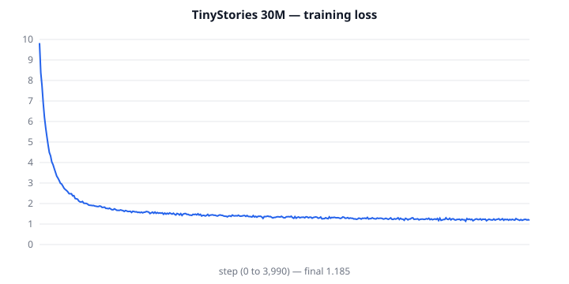
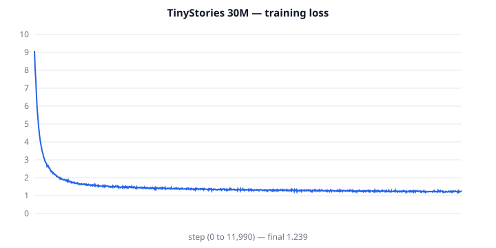
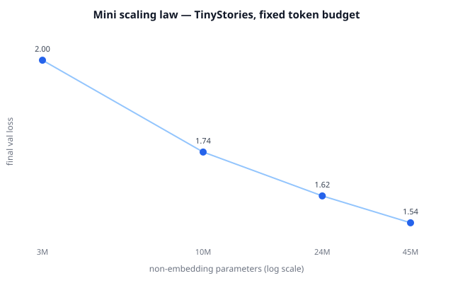

# HandmadeLLM

A modern, Llama-style LLM built **entirely from scratch** — tokenizer, model, training loop, everything. No Hugging Face `Trainer`, no imported tokenizers. Trained, evaluated, quantized and served on a single RTX 5070 Ti (12 GB).

> **Status:** all 8 phases complete, incl. the DPO stretch — from BPE merges to a fused Triton kernel. Two trained models (30M + 113M flagship), every number below reproducible. See [Roadmap](#roadmap).

**One project that is really three** — an LLM from scratch, an eval harness, and inference optimization:

| what | headline number |
|---|---|
| Flagship 113M trained from scratch | val loss 1.26, ~5 h, **5.3 GB** peak on a 12 GB card |
| Efficiency stack (Phase 2) | bf16 **3.2×** throughput; checkpointing **12.4 → 4 GB** VRAM |
| Scaling law (Phase 3) | **L = 2.197·N^−0.096**, R² = 0.987 |
| Quantization (Phase 4) | int8 **2.7× smaller, +0.0%** perplexity |
| Instruction tuning (Phase 5) | SFT clear before/after; **DPO 0.70 → 0.97** preference acc |
| Ablations (Phase 6) | RoPE +0.078, SwiGLU +0.047 (numbers, not opinions) |
| Fused Triton RMSNorm (Phase 7) | up to **15×** forward vs PyTorch |
| Tests | **58 passing** |

## Results

**The flagship: a 113M-param model** (dim 768, 16 layers, GQA 12q/4kv, 1024 context, own 16k BPE), trained from scratch in **~5 h on one RTX 5070 Ti** (5.3 GB peak thanks to the Phase 2 efficiency stack), final val loss **1.26**, perplexity **3.71**:

> *Prompt:* **Once upon a time there was a little robot**
> …named Jake. Jake was very excited to explore the world. He had never seen so many wonders before! He went to the park and saw a pond full of ice and sparkling water… Soon, the sun started to set and Jake had to go home. He was sad to leave, but he knew he'd be back soon.

Named characters, richer vocabulary, 1024-token context. Full samples: [`samples/flagship_113m.md`](samples/flagship_113m.md).



**The 28M workhorse**, trained from scratch on TinyStories (own 8k BPE tokenizer, ctx 512, ~2.6 h, final val loss **1.24**, held-out **perplexity 3.75**):

> *Prompt:* **Once upon a time there was a little robot**
> …who was very excited. He was always looking for new things to add to his collection of friends. One day, he went out for a walk. As he was walking, he saw a small box… The robot thought for a minute and then said, "Let's add something to the box!" He brought out a toy truck, and they all smiled.

> *Prompt:* **The dragon was very sad because**
> …he had no friends. He thought about all the other animals in the forest and wished he had someone to play with. One day, he had an idea. He went to the village and asked the villagers if they wanted to be his friends… *The moral of the story…*

Full samples: [`samples/tinystories_30m.md`](samples/tinystories_30m.md). Coherent grammar, narrative arc, dialogue, even morals — from 28M parameters.



### Efficiency engineering (Phase 2) — flagship 113M, RTX 5070 Ti 12 GB

Each optimization applied cumulatively. This is the table that makes 12 GB enough:

| setup | micro-batch × accum | tokens/s | peak VRAM (GB) |
|---|---|---|---|
| fp32 baseline | 8×4 | 8,893 | 12.39 (≈ card limit) |
| + bf16 autocast | 8×4 | 28,498 | 9.33 |
| + gradient checkpointing | 8×4 | 23,313 | **3.95** |
| + 3× bigger micro-batch | 24×4 | 22,215 | 8.10 |
| + torch.compile | 24×4 | **34,496** | 6.03 |

bf16 alone is **3.2× throughput**; checkpointing cuts VRAM **12.4 → 4 GB** (unlocking a 3× larger batch); `torch.compile` lands at **34.5k tok/s in 6 GB**. Reproduce: `python scripts/bench_efficiency.py`.

### KV-cache speedup (Phase 4) — flagship 113M, 512-token generation

| mode | tokens/s | p50 (ms) | p95 (ms) |
|---|---|---|---|
| with KV cache | **156** | 3,285 | 3,291 |
| without KV cache | 80 | 6,370 | 6,405 |

**1.94× speedup**, and it grows with context length (the whole point of the cache). Reproduce: `python scripts/bench_inference.py`.

### Mini scaling law (Phase 3) — 4 sizes, fixed token budget

| model | non-emb params | final val loss |
|---|---|---|
| tiny | 3.0M | 1.998 |
| small | 9.7M | 1.739 |
| med | 23.6M | 1.615 |
| large | 45.5M | 1.540 |

Power-law fit **L ≈ 2.197 · N^(−0.096)**, **R² = 0.987** across a 15× parameter range. Reproduce: `python scripts/scaling_study.py`.



### Weight-only quantization (Phase 4) — int8 / int4 from scratch, on the trained 30M

Per-row symmetric quantization ([llm/quant.py](llm/quant.py)), `lm_head` kept full-precision (tied to the embedding):

| precision | linear weights | held-out perplexity | vs fp |
|---|---|---|---|
| fp baseline | 111 MB | 3.42 | — |
| **int8** | 40 MB | 3.42 | **2.7× smaller, +0.0% ppl** |
| **int4** | 29 MB | 3.61 | **3.9× smaller, +5.5% ppl** |

int8 is a free memory win; int4 trades ~5% perplexity for another ~30% off. (Throughput here is dequant→bf16-matmul, so it doesn't beat fp — a fast INT8 GEMM is future work; the measured trade-off is quality vs size.) Reproduce: `python scripts/bench_quant.py`.

### Instruction tuning (Phase 5) — before vs after SFT

Fine-tuned the 30M base on 30k TinyStories-Instruct pairs with **prompt-masked loss** (SFT val loss 1.14). Same prompt, `Words: dog, jump, happy`:

- **Before:** rambles, ignores the required words, leaks spurious `Story:`/`Apparent:` tokens.
- **After:** *"Once upon a time, there was a happy dog. The dog loved to play and jump all day…"* — uses every required word, follows the summary.

Full before/after: [`samples/sft_before_after.md`](samples/sft_before_after.md). Reproduce: `python scripts/sft_compare.py --ckpt checkpoints/sft_30m/best.pt --label after`.

**DPO (stretch) — preference alignment from scratch** ([llm/dpo.py](llm/dpo.py)): DPO loss with a frozen reference model, no reward model or RL. From the SFT checkpoint, held-out **preference accuracy rose 0.70 → 0.97**. Honest caveat on reward over-optimization + reproduce steps in [`samples/dpo_results.md`](samples/dpo_results.md).

### Architecture ablations (Phase 6) — numbers, not opinions

Single change at a time vs the modern baseline, fixed budget on TinyStories:

| change | val loss | Δ |
|---|---|---|
| baseline (RoPE+SwiGLU+RMSNorm+GQA) | 1.813 | — |
| RoPE → learned pos-emb | 1.891 | +0.078 |
| SwiGLU → GELU MLP | 1.860 | +0.047 |
| RMSNorm → LayerNorm | 1.810 | −0.003 |
| GQA → full MHA | 1.798 | −0.014 |

RoPE and SwiGLU clearly earn their place; RMSNorm is chosen for being cheaper (quality-neutral here); GQA trades 0.014 loss for a 3× smaller KV cache. Reproduce: `python scripts/ablations.py`.

**Downstream benchmark — Story-Cloze** ([llm/benchmark_cloze.py](llm/benchmark_cloze.py)): does the model prefer the true last sentence of a held-out story over a distractor ending from another story? Tests coherence, not fluency (chance = 0.50). 30M scores **0.956**, flagship **0.930**. `python -m llm.benchmark_cloze --ckpt checkpoints/tinystories_30m/best.pt`.

### Fused Triton RMSNorm kernel (Phase 7) — dim 768, bf16

A hand-written fused kernel ([llm/triton_rmsnorm.py](llm/triton_rmsnorm.py), forward **and** backward), correctness-tested against the PyTorch reference (`tests/test_triton.py`, 9 cases fp32/bf16):

| tokens (B×T) | torch fwd | triton fwd | fwd speedup | torch fwd+bwd | triton fwd+bwd | fwd+bwd speedup |
|---|---|---|---|---|---|---|
| 4,096 | 0.106 ms | 0.024 ms | **4.5×** | 0.683 ms | 0.243 ms | 2.8× |
| 16,384 | 1.067 ms | 0.071 ms | **15.0×** | 3.131 ms | 0.385 ms | 8.1× |
| 65,536 | 3.809 ms | 0.440 ms | **8.7×** | 13.124 ms | 2.302 ms | 5.7× |
| 262,144 | 14.736 ms | 1.647 ms | **9.0×** | 58.134 ms | 8.702 ms | 6.7× |

One SRAM pass per row vs several HBM round-trips in the reference. Reproduce: `python scripts/bench_triton.py`.

## What's implemented

- **Byte-level BPE tokenizer from scratch** ([llm/bpe.py](llm/bpe.py)) — merge training with incremental pair counts, encode/decode, save/load. Fully tested, including UTF-8/emoji roundtrips.
- **Llama-style transformer** ([llm/model.py](llm/model.py)):
  - RoPE (rotary position embeddings)
  - RMSNorm (pre-norm)
  - Causal attention with **GQA** (grouped-query attention)
  - SwiGLU MLP, weight tying, GPT-2-style scaled residual init
  - **KV cache** for generation, with tests proving cached ≡ uncached greedy decoding
- **Hand-written training loop** ([llm/train.py](llm/train.py)) — AdamW with decay/no-decay groups, bf16 autocast, gradient accumulation, gradient clipping, cosine LR with warmup, gradient checkpointing, `torch.compile`, checkpoint/resume, JSONL metrics + optional W&B.
- **Data pipeline** ([scripts/prepare_tinystories.py](scripts/prepare_tinystories.py)) — TinyStories → own tokenizer → uint16 memmap bins, multiprocess tokenization.
- **Test suite** ([tests/](tests/)) — causality, KV-cache equivalence, RoPE relative-position property, GQA shapes, BPE roundtrips, overfit smoke test.
- **Serving + eval scaffolding** — FastAPI streaming endpoint ([serve/app.py](serve/app.py)), KV-cache speedup benchmark ([scripts/bench_inference.py](scripts/bench_inference.py)), efficiency benchmark ([scripts/bench_efficiency.py](scripts/bench_efficiency.py)), held-out perplexity ([llm/eval.py](llm/eval.py)).

## Verified on hardware

Phase 0 definition-of-done (RTX 5070 Ti Laptop, Blackwell `sm_120`, torch 2.11 cu128):

| Check | Result |
|---|---|
| `torch.cuda.is_available()` | ✅ torch 2.11.0+cu128, capability `(12, 0)` |
| Overfit one batch, 9.8M model, 500 steps | loss **5.51 → 0.0043** in 17.3 s |
| Throughput (bf16, batch 32×256) | **237k tok/s** |
| Peak VRAM | 1.29 GB |
| Test suite | 22/22 passing |
| 30M TinyStories run | final val loss **1.24**, 12k steps, ~2.6 h |

Reproduce with `python scripts/overfit_sanity.py`.

## Quickstart

```bash
# 1. Environment (Blackwell needs the cu128 wheels)
python -m venv .venv && .venv/Scripts/activate
pip install torch --index-url https://download.pytorch.org/whl/cu128
pip install -r requirements.txt

# 2. Sanity check: overfit one batch (proves the whole stack works)
python scripts/overfit_sanity.py

# 3. Data + tokenizer (TinyStories, ~2 GB download)
python scripts/prepare_tinystories.py --vocab-size 8192

# 4. Train the 30M model
python -m llm.train --config configs/tinystories_30m.yaml

# 5. Generate
python -m llm.sample --ckpt checkpoints/tinystories_30m/best.pt --prompt "Once upon a time"

# 6. Evaluate + serve
python -m llm.eval --ckpt checkpoints/tinystories_30m/best.pt --bin data/tinystories/val.bin
python scripts/bench_inference.py --ckpt checkpoints/tinystories_30m/best.pt   # KV-cache speedup
HLLM_CKPT=checkpoints/tinystories_30m/best.pt uvicorn serve.app:app --port 8000
```

Run tests: `pytest tests/ -v`

## Architecture

| | 30M ([config](configs/tinystories_30m.yaml)) | Flagship 113M ([config](configs/flagship_113m.yaml)) |
|---|---|---|
| dim / layers | 512 / 8 | 768 / 16 |
| heads (q / kv) | 8 / 4 | 12 / 4 |
| context | 512 | 1024 |
| vocab (own BPE) | 8,192 | 16,384 |
| effective batch | 131k tok | 164k tok |

## Project structure

```
llm/            core library (all hand-written)
  bpe.py          byte-level BPE tokenizer (merge training + encode/decode)
  model.py        Llama-style transformer: RoPE, RMSNorm, GQA, SwiGLU, KV cache
  train.py        training loop (AdamW, bf16, grad accum/checkpointing, cosine LR)
  sft.py          instruction tuning (prompt-masked loss)
  dpo.py          Direct Preference Optimization (frozen reference model)
  quant.py        int8/int4 weight-only quantization
  triton_rmsnorm.py   fused Triton RMSNorm kernel (fwd + bwd)
  eval.py / rubric.py / benchmark_cloze.py   eval harness
configs/        versioned experiment configs (30M, flagship, scaling/, ablations/)
scripts/        data prep + benchmarks (efficiency, inference, quant, triton, scaling)
serve/          FastAPI streaming endpoint
tests/          58 tests (correctness, KV-cache equivalence, RoPE, DPO, quant, ...)
samples/        generation samples, loss curves, scaling/ablation/DPO results
WRITEUP.md      the honest engineering log
```

## Roadmap

- [x] **Phase 0** — env de-risk (Blackwell + cu128), repo scaffold, overfit sanity ✅
- [x] **Phase 1** — BPE tokenizer, Llama-style model, training loop, tests; **30M trained, coherent stories** ✅
- [x] **Phase 2** — efficiency study: before/after table (bf16, grad accum, checkpointing, flash SDPA, compile) ✅
- [x] **Phase 3** — flagship 113M trained (val 1.26, ~5h) + mini scaling-law study ✅
- [x] **Phase 4** — KV-cache benchmark ✅, int8/int4 quantization ✅, FastAPI streaming endpoint ✅ (fast INT8 GEMM = future work)
- [x] **Phase 5** — SFT instruction tuning ✅ (val 1.14) + **DPO** ✅ (preference acc 0.70→0.97)
- [x] **Phase 6** — perplexity ✅, generation rubric ✅, ablations ✅, Story-Cloze downstream benchmark ✅
- [x] **Phase 7** — fused Triton RMSNorm kernel (fwd+bwd) + correctness tests + benchmark (up to 15× fwd) ✅
- [x] **Phase 8** — technical writeup ([WRITEUP.md](WRITEUP.md)) with all real numbers + a "what didn't work" section ✅

*Optional future work:* a fast INT8 GEMM (quant currently saves memory, not latency) and a fused attention kernel.

## Design decisions

- **GQA over MHA**: 4 KV heads for 12 query heads cuts KV-cache memory ~3× at inference, nearly free in quality at this scale — and it's what 2024/25 production models actually do.
- **Byte-level BPE**: no out-of-vocabulary tokens ever; the tokenizer is ~200 lines and auditable. Training uses incremental pair counting (only words containing the merged pair are touched), so an 8k vocab trains in minutes in pure Python.
- **SDPA for attention**: `F.scaled_dot_product_attention` gives flash/mem-efficient kernels today; a hand-written Triton kernel replaces RMSNorm later as a like-for-like benchmark (Phase 7).
- **uint16 memmap data**: the whole dataset never touches RAM; random-offset sampling keeps the loader at ~zero cost vs the GPU step.

## License

MIT
